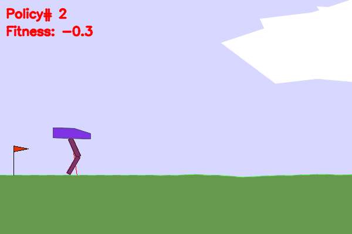

# Novelty Search Using Generalized Behavior Metrics - Master Thesis
This repository contains the spaghetti code I've used in my masters thesis

## Environments

## Interesting Walker Behaviors
 
 
 
 
 
 
 
 

## Swimmer vs Benchmark

## Maze

## UR5
