# Novelty Search Using Generalized Behavior Metrics - Master Thesis
> Thesis submitted at University of Souther Denmark for MSc in Advanced Robotics

## Author
*  Benjamin B. Longet

## Supervisor
*  Anders L. Christensen

## Abstract
Final abstract from the report goes here ...

## Environments
Four different environments running on 3 different physichs engines are used to show the level of generalization achieved in this project.
### Box2D BipedalWalker-v3
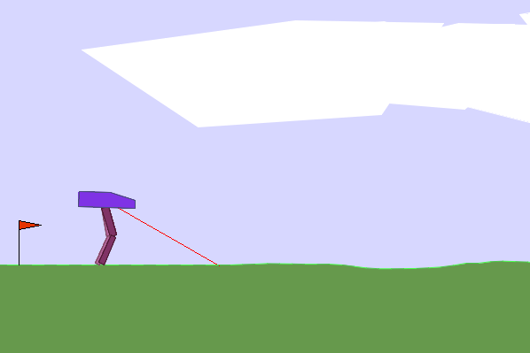

### MuJoCo Swimmer-v4
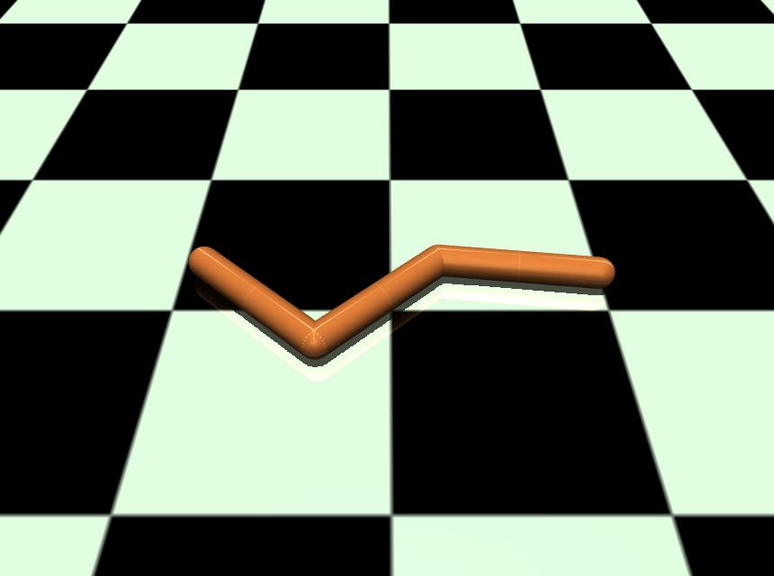

### PyBullet UR5
This environment is based on the implementation from https://github.com/WanqingXia/HiTS_Dynamic/tree/main.

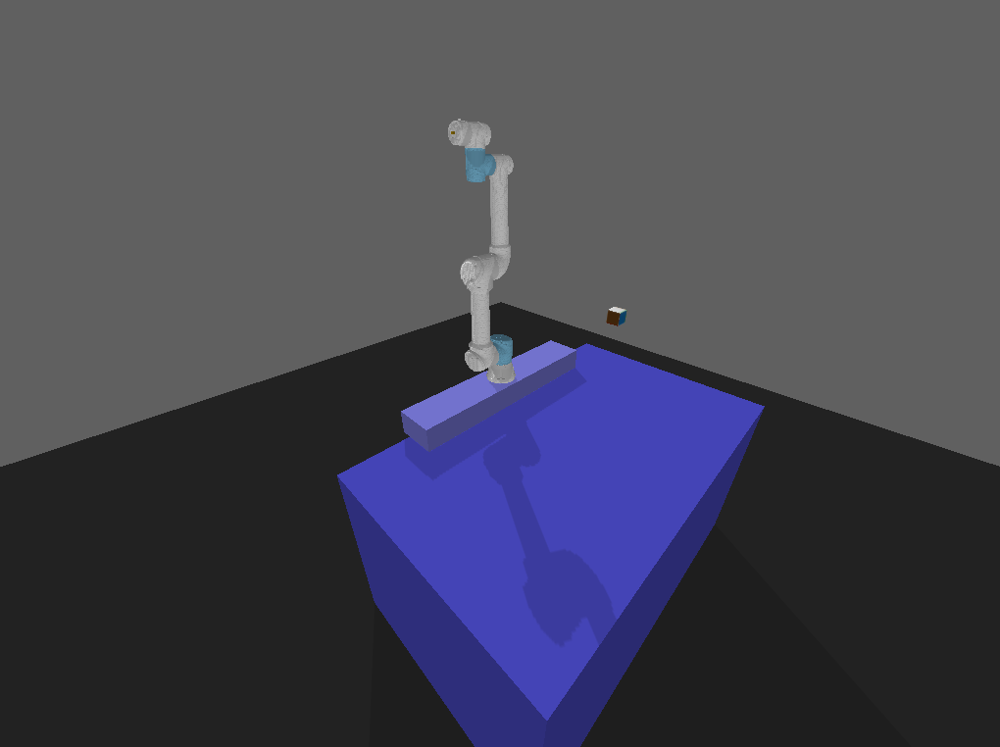

### MuJoCo PointMaze
Some slight changes are made to the original reward function, these are found in [maze](maze) and should replace the corresponding folders in the GymnasiumRobotics site-packages.

#### Deceptive
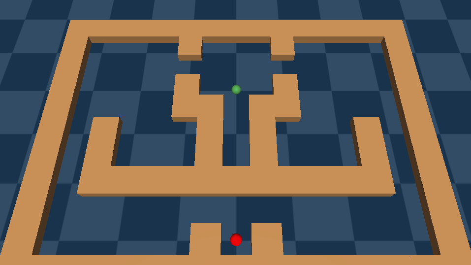

Additionally, an open variant of the maze is used, where all walls are removed, and the fitness score is either changed to be a factor of the x-velocity or removed all together.

## Interesting Walker Behaviors
None of the encoutered novel walker behaviors had any relevant increase in sample effeciency or final reward compared to the fitness based solution. A significant amount of vastly different behaviors were encountered, many of which were able to achieve a decent score. A few selected behaviors are seen in the following gifs, the first of which being the behavior that usually occurs from following the fitness gradient alone.

 ,
 ,
 ,
 ,
 ,
 ,
 ,
 

## Swimmer vs Benchmark
The generic fitness based Swimmer opts to swim sideways, as this obtains a constant positive reward.
One specific behavior for the Swimmer turned out to be quite decent. Here the Swimmer learns to swim more like an eel where the overall reward is much higher, but a lot of the stepwise rewards are in the negative. This behavior is quite rare, most of the other encountered behaviors seem to primarily follow the novelty gradient.

, 
 

Note that these gifs does not show the episode to completion. The evaluation reward after every policy update is used to generate the following graph:

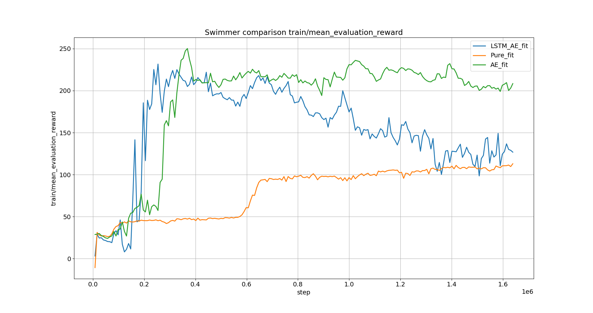

Comparing with the benchmark from https://spinningup.openai.com/en/latest/spinningup/bench.html, it is clear that the specific behavior must be quite rare, as none of the benchmarked algorithms comes anywhere near the achieved score.

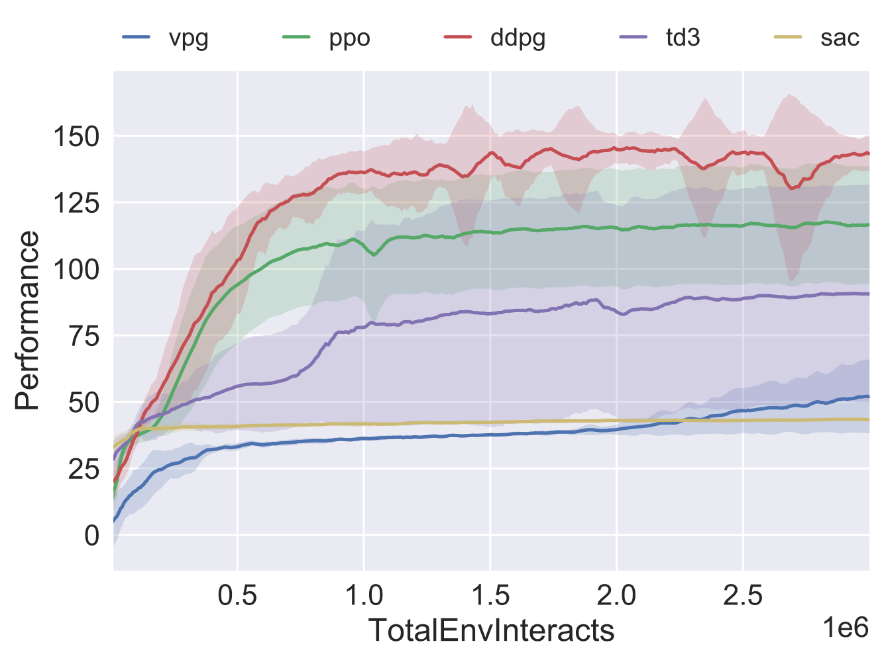

## UR5
5 tests were conducted with the linear AE, training 8 novel policies. The average amount of different inverse kinematics solutions found were 3.8 / 8.0

The following gifs show the result of a test that found 5 sepperate configurations:

 ,
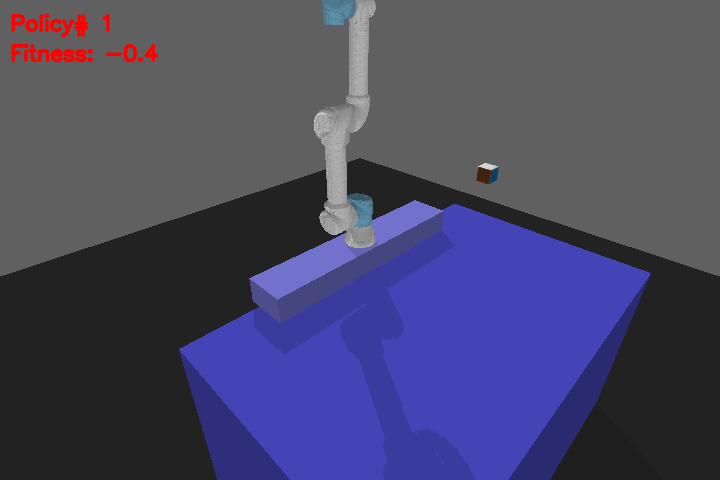 ,
 ,
 ,
 ,
 ,
 ,
 

## Maze
Fitness with high reward noise result:

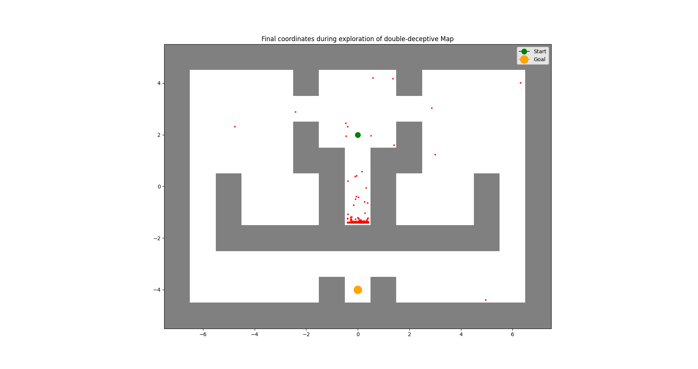

### Linear Autoencoder
#### Deceptive Maze Trajectories

#### Open Maze Variant
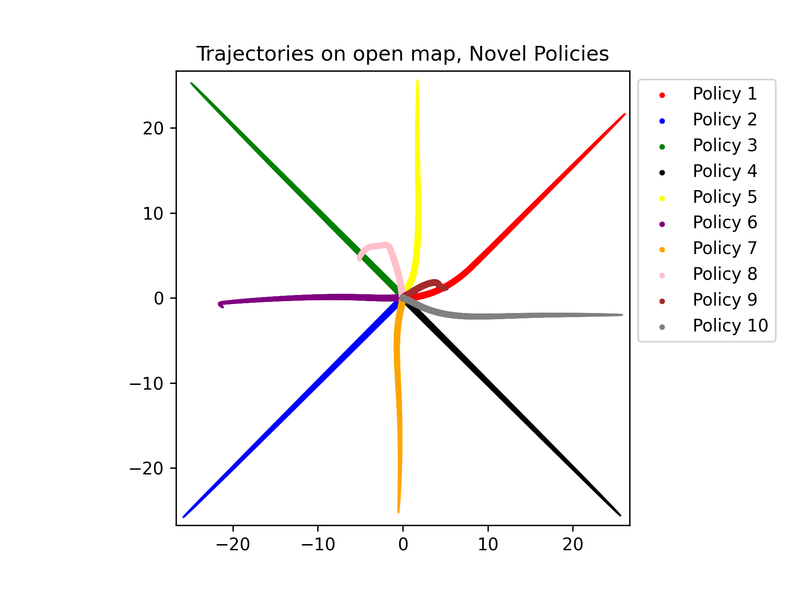 ,
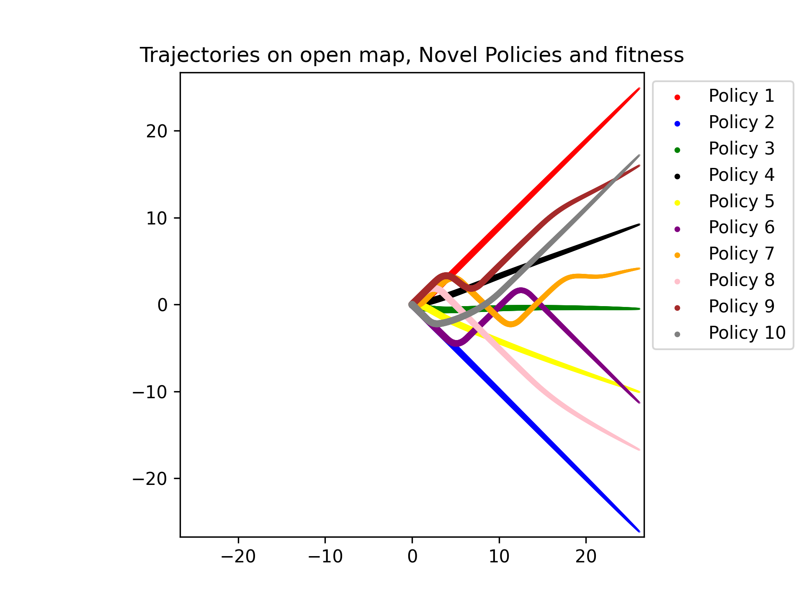

### LSTM-Autoencoder
#### Deceptive Maze Scatterplot
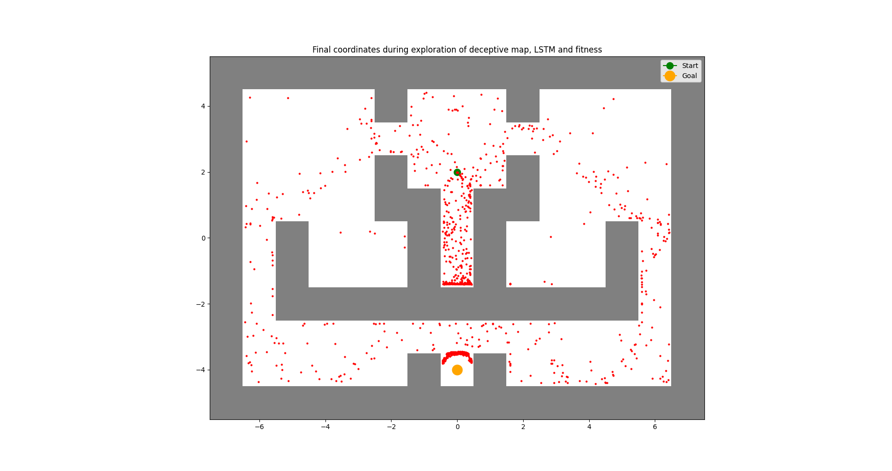

#### Open Maze Variant
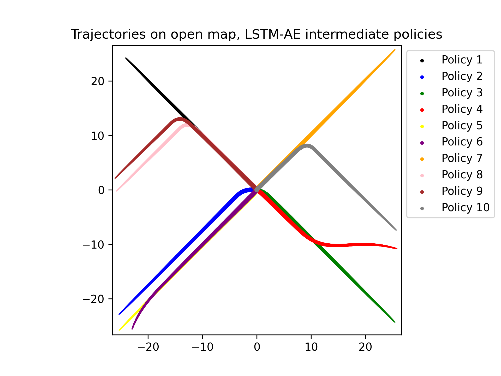, 
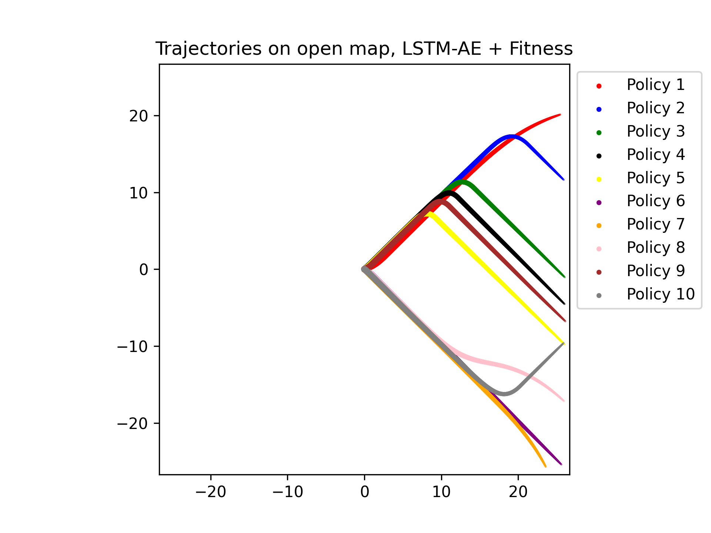

### Combined Novelty Search
#### Deceptive Maze Dual Trajectories
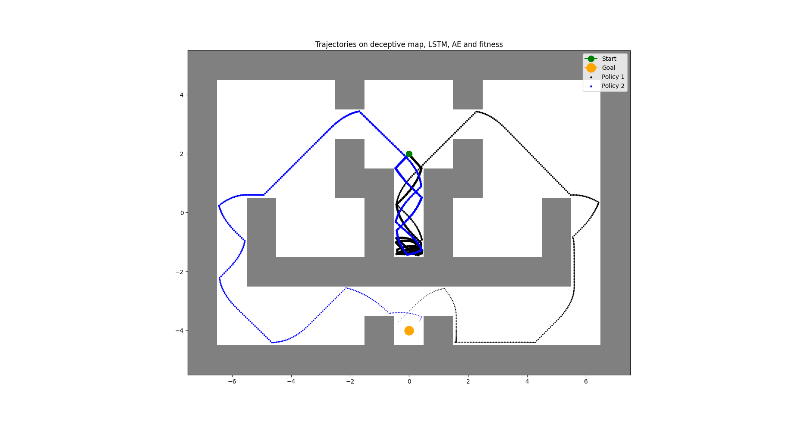

#### Open Maze Variant
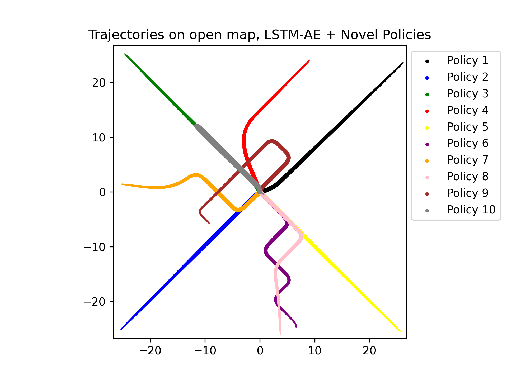 ,
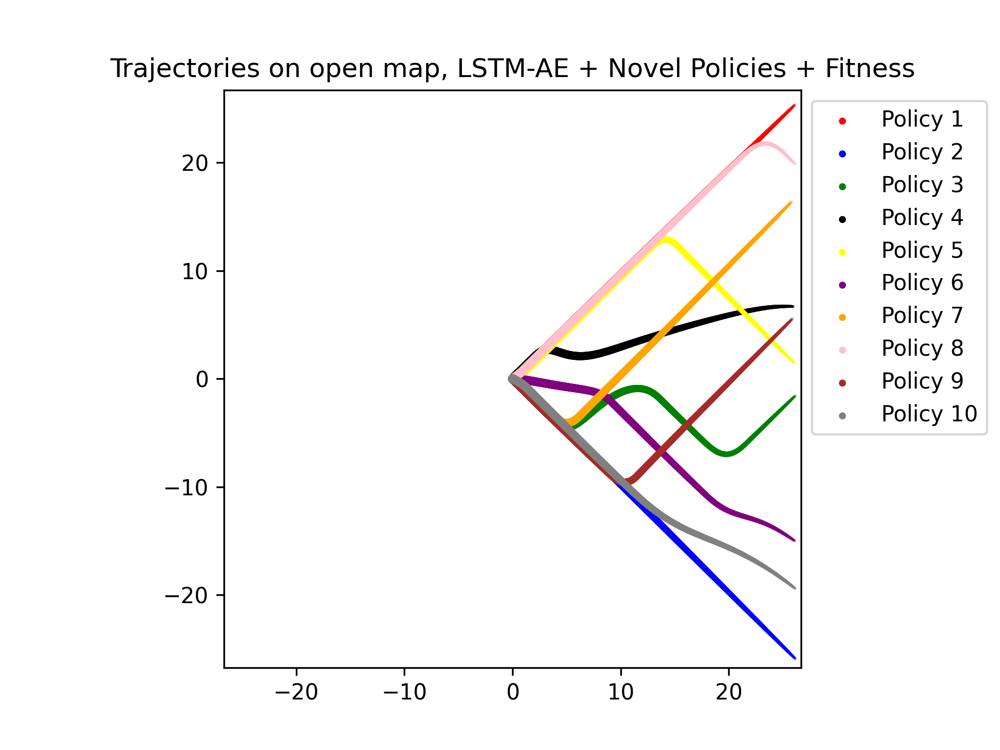

### Frechet Distance Results
5 tests on the open maze variant were conducted, where the Frechet distance with a threshold of 2.5 was used to determine whether trajectories were different. The tests using linear autoencoders had to be above the treshold for all other trajectories to be deemed unique. The tests where only LSTM-AE or fitness were used had to have trajectories being different for intermediate policies that were saved 10 iterations apart. 

The final average results are: 

| Test  | Average Score |
| ------------- | ------------- |
| Fitness  | 3.0 / 10.0  |
| Linear AE  | 9.6 / 10.0  |
| Linear AE + Fitness  | 9.6 / 10.0  |
| LSTM-AE  | 8.6 / 10.0  |
| LSTM-AE + Fitness  | 5.4 / 10.0  |
| Linear AE + LSTM-AE  | 9.8 / 10.0  |
| Linear AE + LSTM-AE + Fitness  | 8.8 / 10.0  |

